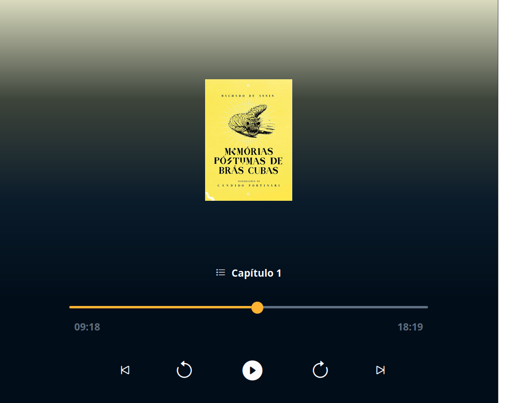

# 🎧 Audible Clone

Um clone do Audible desenvolvido durante o [Minicurso de ReactJS](https://www.youtube.com/watch?v=SspuJnpfVP0&list=PLpdAy0tYrnKz5tdfml_X771VAZsIx3GC-&index=6) da [Hashtag Treinamentos](https://blp.hashtagtreinamentos.com/links-instagram?fonte=biohashp&origemurl=hashtag_yt_org_bio_hashp&utm_source=instagram-org&utm_medium=bio).  

O objetivo é praticar **React** e **conceitos modernos de front-end**, criando uma interface semelhante ao player do Audible.

---

## 🛠️ Tecnologias Utilizadas

### Front-end


### Ferramentas


---

## 🚀 Como rodar o projeto

### ✅ Pré-requisitos
- [Node.js](https://nodejs.org/) (versão 16 ou superior)
- [npm](https://www.npmjs.com/) ou [yarn](https://yarnpkg.com/)

### 📥 Clonar o repositório
```bash
git clone https://github.com/eriick-monteiro/Spotify-Clone.git
cd Spotify-Clone
```

### 📦 Instalar dependências
```bash 
npm install
# ou
yarn install
```

### ▶️ Rodar em ambiente de desenvolvimento
```bash
npm run dev
# ou
yarn dev
```

Por padrão o Vite vai rodar em:
<br>
👉 http://localhost:5173

### 📦 Build para produção
```bash
npm run build
npm run preview
```

### 📂 Estrutura do projeto
Audible-Clone/
├── public/
│   └── index.html
├── src/
│   ├── assets/        # Imagens e ícones
│   ├── components/    # Componentes React
│   ├── App.jsx
│   └── main.jsx
├── package.json
├── vite.config.js
└── README.md

### 📸 Preview
